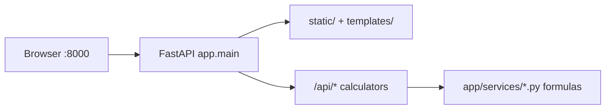

# My Operations (FastAPI + Fancy UI)

## Location
This app lives in [`my_operations/`](.) inside the Jarvis workspace.

## Goals
- Small FastAPI app for calculation tools and future small utilities
- Fancy UI with a **left sidebar** listing tasks; selecting a task shows that tool in the main panel
- Each calculation result includes an **(i) info icon** that reveals the exact formula/logic used
- **UI and backend on the same port** (FastAPI serves static/HTML + JSON APIs)
- [`CLAUDE.md`](CLAUDE.md) documents the high-level codebase
- A Cursor rule ensures CLAUDE.md is **referred to and updated** whenever new functionalities are added

## Architecture



Same process, same port: `uvicorn app.main:app` serves both the page and the APIs.

## Structure
```
my_operations/
  app/
    __init__.py
    main.py                 # FastAPI: mount static, serve index, register API routers
    routers/
      __init__.py
      calculators.py        # POST /api/sustain, POST /api/duration
    services/
      __init__.py
      calculators.py        # Sustain TPS + fixed dataset duration formulas
  requirements.txt
  README.md
  CLAUDE.md               # High-level map (agents must keep this current)
  PLAN.md                 # This plan file
  .cursor/rules/
    my-operations-docs.mdc    # Auto-update CLAUDE.md when adding features
  static/
    css/app.css
    js/app.js             # Sidebar nav, fetch calls, (i) popover
  templates/
    index.html            # Shell: sidebar + main content panels
```

## Initial sidebar tasks
1. **Sustain TPS** — inputs: TPS, minutes → total transactions  
   Formula shown via (i): `transactions = tps × 60 × minutes`
2. **Fixed dataset duration** — inputs: transactions, TPS → seconds + minutes  
   Formula shown via (i): `seconds = transactions ÷ tps`

Each API response includes a `formula` (and short `explanation`) field so the UI can show the same logic the backend used — no duplicated mystery math in the browser.

Example response shape:
```json
{
  "transactions": 360000,
  "formula": "transactions = tps × 60 × minutes",
  "explanation": "300 TPS × 60 sec × 20 min = 360,000 transactions",
  "inputs": { "tps": 300, "minutes": 20 }
}
```

## UI design
- Dark, polished single-page shell (sidebar + content), not a bare form dump
- Left sidebar: app title + scrollable task list; active task highlighted
- Main panel: task title, short description, inputs, Calculate, result card
- Result card: primary answer + **(i)** button/icon that opens a small popover/modal with `formula` + `explanation` from the API
- Client-side only switches panels (no full page reload); APIs via `fetch`
- Responsive enough for desktop use (primary target)

## Same port
- `GET /` → Jinja/static HTML shell
- Static assets under `/static/...`
- JSON under `/api/...`
- One command: `uvicorn main:app --reload --port 8000`

## CLAUDE.md (high-level)
Will cover:
- Purpose of the toolkit
- Folder map and what each layer owns
- Current sidebar tasks and their endpoints/formulas
- How to add a new task (checklist: logic module → router → sidebar entry → CLAUDE.md update)
- Run instructions

## Auto-update instructions (Cursor rule)
Add [`.cursor/rules/my-operations-docs.mdc`](.cursor/rules/my-operations-docs.mdc) scoped to `my_operations/**` that requires agents to:
1. Read `CLAUDE.md` before changing the app
2. When adding/changing a task, API, or formula: update `CLAUDE.md` in the same change (sidebar list, endpoints, formulas, folder map)
3. Keep the “How to add a new task” checklist accurate

This is how “whenever new functionalities are added, CLAUDE/instructions are referred and updated automatically” works in practice: the rule binds agent behavior in this folder.

## Run
```bash
cd my_operations
pip install -r requirements.txt
uvicorn app.main:app --reload --port 8000
```
Open `http://127.0.0.1:8000`
